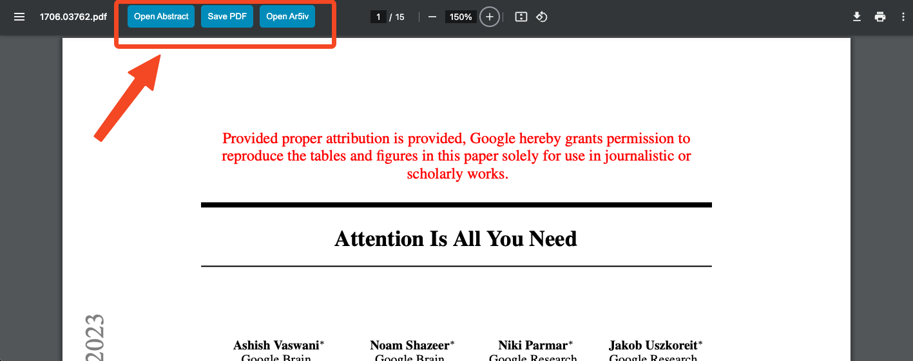

# Arxiv-QoL-Snippets
Adds some functionality that makes daily Arxiv browsing better 🌟

## Features
1. Adds a button to directly open the abstract of a paper in a new tab
2. Adds a button to save the PDF with the name of the paper
3. Adds a button to open the Ar5xiv page in a new tab

## Installation
1. Install a userscript manager like [Tampermonkey](https://chromewebstore.google.com/detail/tampermonkey/dhdgffkkebhmkfjojejmpbldmpobfkfo)
2. Create a new script and paste the contents of `arxiv-qol-snippets.js` into it
3. Save the script and refresh the Arxiv page
4. Enjoy the new buttons!

